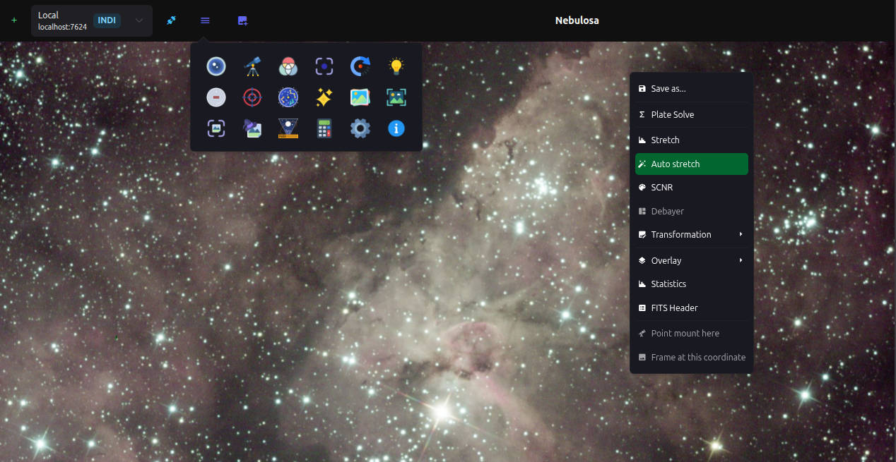

# Nebulosa Server

The Nebulosa's server & web application.

[](https://gist.github.com/cheerfulstoic/d107229326a01ff0f333a1d3476e068d)
[](https://github.com/tiagohm/nebulosa.server/actions/workflows/ci.yml)



## Running

To install dependencies:

```bash
bun i
```

To run:

```bash
bun run main.ts --port 3000
```

To run in development mode:

```bash
bun dev
```

To run tests:

```bash
bun test --timeout 10000
```
